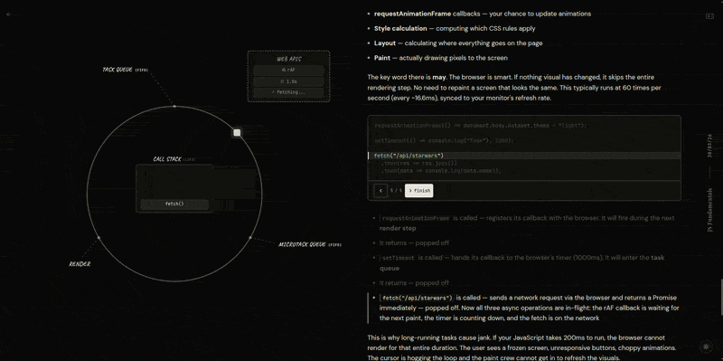
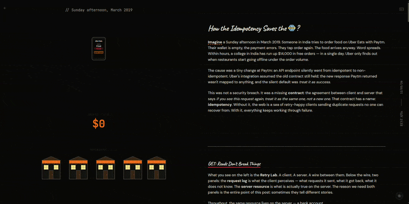

# [imcurious.how](https://imcurious.how)

  
  

  
  
  
  
  
  
  

A small collection of interactive, animated explainers for web concepts I wanted to understand more deeply. Each post is an MDX essay wired up to its own custom visualization.

Currently:

- **How the JavaScript Event Loop Works?** — a scroll-driven walk around the event loop as a circular track, with the call stack, Web APIs, and queues animating in sync.
- **How Idempotency Saves the Web?** — a packet-on-a-wire simulation showing what retries do (and don't do) to non-idempotent endpoints, framed around a fictional Uber ride.
